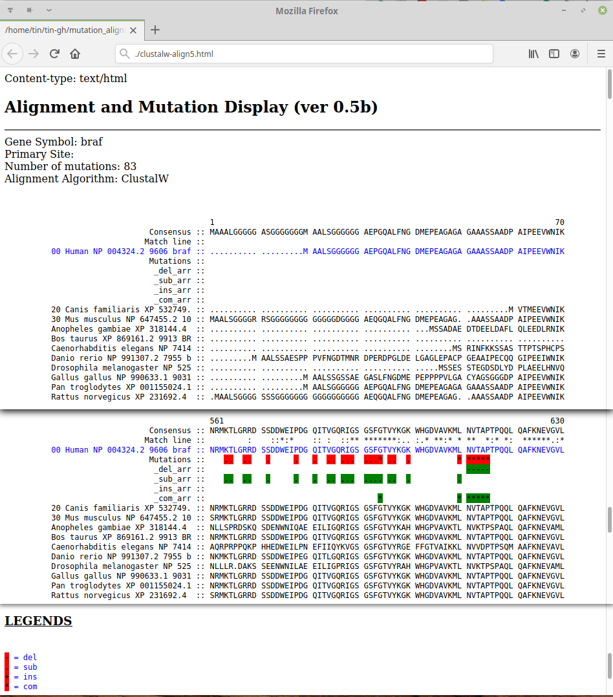

Web clustalw multi aligner
==========================

A simple multi-sequence alignment tool using clustalw
with highlight for mutation location
output to html

This was written back in the days using OO Perl.  
Contact me for full source code, which may need to go thru some redaction ;-)  
